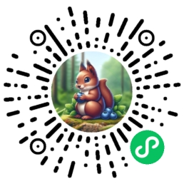

# yichun-guide-app

**使用 vue-mini 开发，使用 create-vue-mini 创建。使用 Skyline 渲染，支持深色模式，数据库和文件存储使用微信小程序自带的云开发。**

扫码体验：



**源码仅供学习交流，欢迎 Star 和 Fork。**

## 开发

⚠️ 注意：将此项目导入微信开发者工具时请选择项目根目录而非 `dist` 目录。

更多信息请访问官方文档：[vuemini.org](https://vuemini.org)

## 数据库集合

- 景点：`TouristAttraction`
- 特产：`Specialty`

权限选择“自定义安全规则”，设置为：

```json
{
  "read": true,
  "write": false
}
```

## 文件存储结构

- `/assets/`：存放固定的图片资源
- `/tourist-attraction/:id/`：存放景点的图片
- `/specialty/:id/`：存放特产的图片

权限选择“所有用户可读”。

## 设置环境变量

创建 `.env.local` 文件，复制 `.env.template` 文件内容到 `.env.local` 文件中，并根据实际情况修改其中的环境变量。

## 依赖安装

```sh
yarn
```

## 本地开发

```sh
yarn dev
```

## 生产构建

```sh
yarn build
```

## 代码格式化

```sh
yarn format
```

## TS 代码质量检测

```sh
yarn lint:script
```

## CSS 代码质量检测

```sh
yarn lint:style
```

## 类型检测

```sh
yarn type-check
```

## License

[GPL-3.0](./LICENSE)
